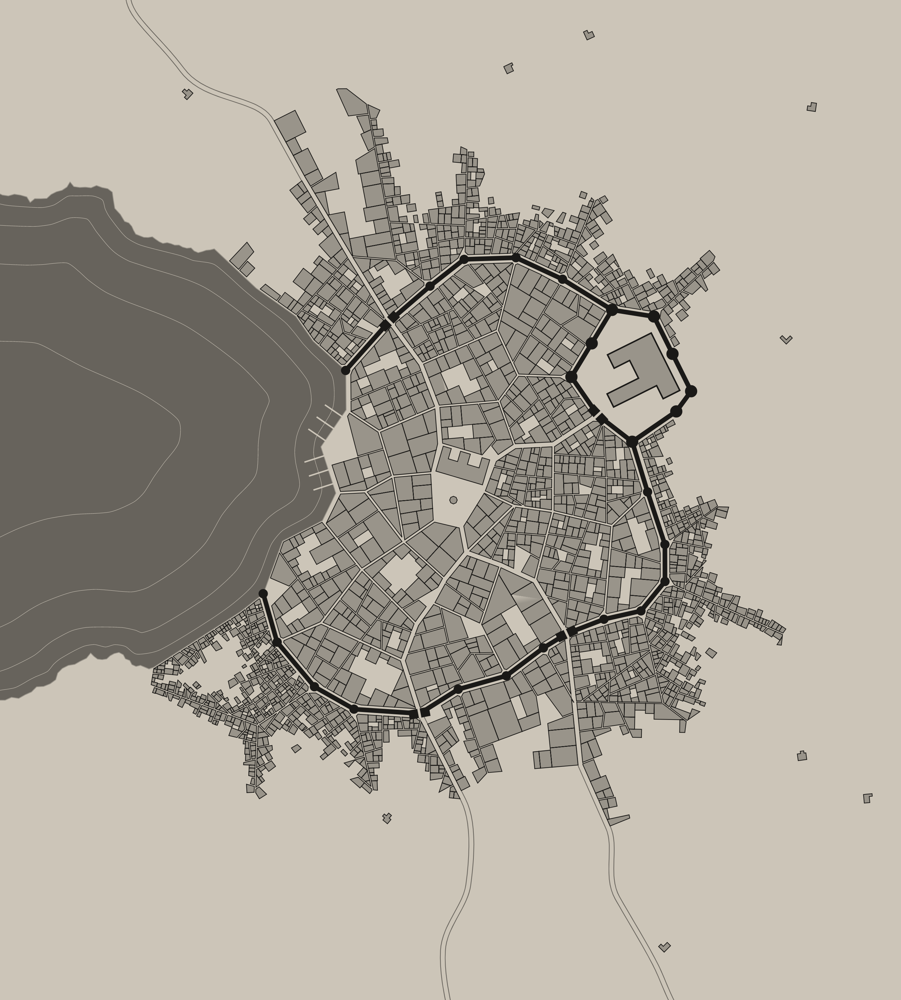

# Nexus, City of Coins

[Scarred World](./readme.md) > City of Coins

Nexus a is port city with a population of aproximately 200K. Commonly called the City of Coins its culture and politics are almost completely dominated by trade and commerce. Nexus is located between its two primary trading partners, the cities of [Spire]() and [Karrgerra](). Its chief exports are the [Poof](./poof.md) created by the feeders, wonderous items created by the [Wizards Guild]() and all manner of exceptional inert items created by the [Tradesman's Guild]().

## The Pentacouncil
Nexus is governed by the *Pentacouncil* which consists of a *Chair* and four *Members*. *Chair* belongs to the [Adjudicators](./adjudicators.md). *Member* seats belong to [Magnus Arcanus](./magnus-arcanus.md), the [Feeders](./pantheon.md), the [Commerce Guild]() and the [Merchant-Traders](./merchant-traders.md).

The *Chair* has ultimate responsibility for the safety and well-being of the city and its citizens. In also has primary control of city's military might at need.

Current Pentacouncil
- *Chair*: Barret Highreach, *Judge General* of the [Adjudicators](./adjudicators.md)
- *Member*: *Archmage* Xocktol, [Magnus Arcanus](./magnus-arcanus.md)
- *Member*: Fatus Blimpus, his *Excellancy* of the order of the [Feeders](./pantheon.md)
- *Member*: Darin Dokow, *Chief Operating Officer* of the [Commerce Guild]()
- *Member*: Aman the Magnificent, Maker of Coin, *Representitive* of the [Merchant-Traders](./merchant-traders.md)

## Taxes
All business transactions in Nexus have a base 10% *Tax* applied. All prices listed in the PH or otherwise should be increased by 10%. Any party or individual found trying to avoid this lawfully due *Tax* will be subject to immeadiate punishment up to and including [Expulsion]().

## Catecomes

## Other powerful entities in the city
- Adjuticators
    - The Justiciars
- Thieves Guild
- Radiant Arms (Paladins)
- Evil priests
- Merchant-Traders
    - The Theater Company (Sorcerers and Bards)
    - Trade Company like The Black Company
    - Tradesmens Guild
- Vampire Paladin
