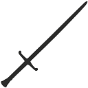

# Pantheon of the Scarred World 
[Scarred World](./scarred-world.md) > Pantheon of the Scarred World

After the cataclysm most divine powers abandoned the Scarred World for lack of worshippers. They deemed it a dead world no longer worth their attention they turned away. Only three, lesser deities, remained. Each laid claim to broad domains of influence.

### Raya [NG]

Typically appearing as a beautiful human female Raya reigns over the domains of life, love, peace, justice, fertility, food, music drink and joy. Her most common symbol is the golden chalice.

### Seethisat [NE]

Seethisat takes many forms. Perhaps the most common is a desiccated giant clothed in robes of flowing darkness. His domains of influence include pain, death, plague, sickness, starvation, assassination, deception, anger, vengeance and murder. The red skull is universally known to be the sign of Seethisat.

### Jarl-Kahn [N]
Jarl-Kahn commonly appears as powerfully built and extremely charismatic male of whichever race a worshiper happens to be. Whatever his form his sword Luckstrum is invariably at his side. Jarl-Kahn's domains include war, combat, bravery, swiftness, luck, athletics, mischief, gambling, drinking and fornication. His most common symbol is a plain sword.

