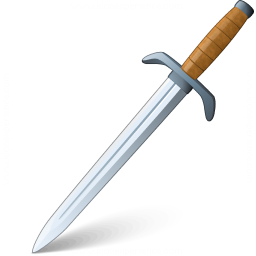

# Scarred World Pantheon
[Scarred World](./scarred-world.md) > Pantheon

When the cataclysm occurred most of the gods abandoned the Scarred World and the few that remained claimed much broader domains of influence.

### Raya, [NG]

Typically appearing as a beautiful human female Raya reigns over the domains of life, love, peace, justice, food, music drink and joy. Her most common symbol is the golden chalice.

### Seethisat [NE]

Seethisat takes many forms though most commonly he appears as a desiccated lich-like figure. His domains of influence include pain, death, plague, sickness and starvation. The red skull is universally known to be the sign of Seethisat.

### Jakahn (N)
Jakahn commonly appears as a powerfully built human male. His sword Luckstrum is invariably at his side. Jakahn's domains include war, combat, bravery, swiftness, luck, athletics, gambling, drinking and fornication. His most common symbol is a plain sword.

