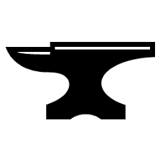

# The Tradesmen's Guild
[Scarred World](./scarred-world.md) > [City of Coins](./city-of-coins.md) > [Merchant-Traders](./merchant-traders.md) > Tradesmen's Guild

*The Tradesmen's Guild* is a child organization of the [Merchant-Traders](./merchant-traders.md) which represents an array of commercial craftsmen, builders and artisans in the [City of Coins](./city-of-coins.md). Members typically identify themselves with the symbol of an anvil.

